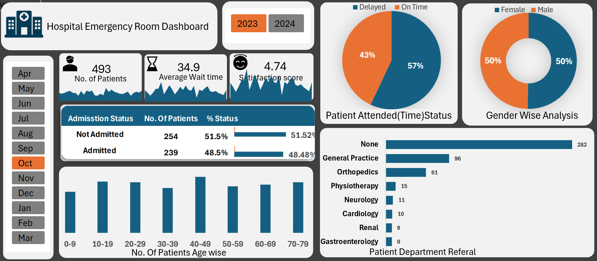

# Hospital Emergency Room Dashboard

## 📌 Project Overview

This Excel dashboard was created to analyze and monitor hospital emergency room data. It helps understand patient trends, improve response times, and provide useful insights to hospital management.

The goal of this project is to make emergency room operations more efficient by tracking key performance indicators (KPIs) in a visual and interactive way.

---

## 📊 KPIs Tracked

- Total number of patients visits in Emergency Room.
- Average time for which patient wait to attend.
- Patient satisfaction score.
- Admission status (Admitted vs Not Admitted).
- Patient attended status (On time vs Delayed).
- Gender-wise patient analysis.
- Age group distribution.
- Count of Department by which the patient is referred.

---
## 📌 Process Used in Project
-firstly the data is cleaned using the POWER QUERY,like
first + last name = Full name
True = Admitted
False = Not-Admitted
M/Male = Male
F/Female = Female
-Then a calendar table is created to handle the missing data in the Data and Relationship is established using POWER PIVOT between date table and Data table.
-Then as per the KPI's requiremnets the PIVIT TABLE  created on different sheets and the required data is fatched in the Dashboard also a map showing the trends of fields is added in Dasboard.
-The Graph on dashboard is linked with the sheet which contains the actul and big format of the Graph and a home tab is added on the graph which is linked with the Dashboard sheet.

## 🧰 Excel Features Used

- Power Query (for data cleaning)
- Pivot Tables & Charts
- Slicers (for month and year selection)
- Hyperlink for linking the Dashboard graph to the sheet of graph which contained Expanded view to analyse 
- Conditional Formatting
- Form Controls (Toggle buttons)
- Dashboard layout and formatting

---

## 📷 Dashboard Preview

---
